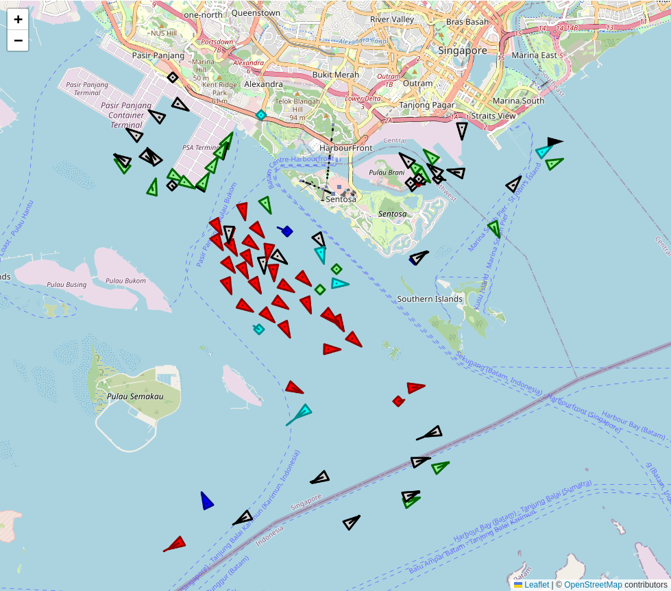

# leaflet-tracksymbol2

[[Leaflet](https://leafletjs.com/) plugin]
Symbol for showing tracks with heading, course and speed.

Updated version of:
* [leaflet-tracksymbol](https://www.npmjs.com/package/leaflet-tracksymbol)
* [leaflet-ais-tracksymbol](https://github.com/PowerPan/leaflet-ais-tracksymbol)

[Documentation](https://org-arl.github.io/leaflet-tracksymbol2/)

